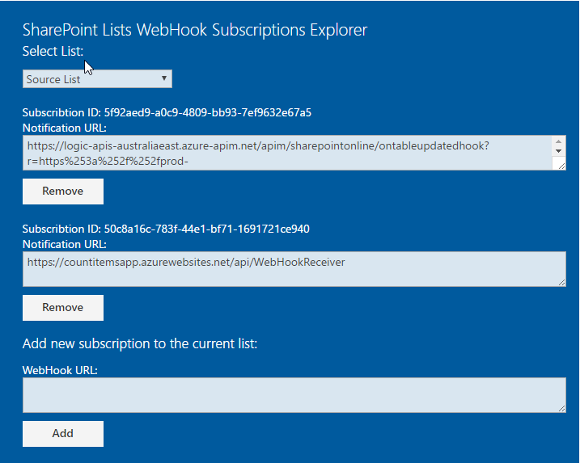
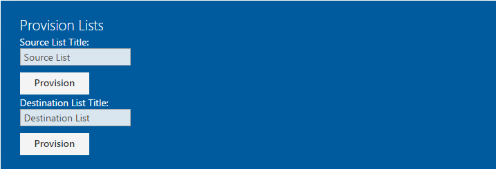
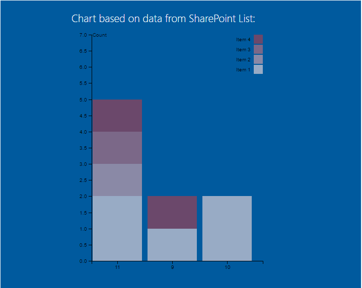
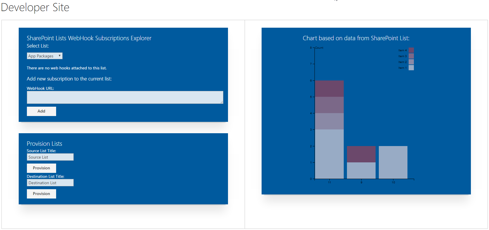

# Serverless Samples

#### SharePoint Lists Subscriptions Explorer Web Part

SPFx webpart that shows web hook subscriptions of the selected list:

#### SharePoint Lists Provisioning Web Part

SPFx webpart that calls corresponding Azure Functions with parameters:

#### Stacked Chart Web Part

SPFx webpart that shows stacked bar chart based on data from the list:

#### Page 

